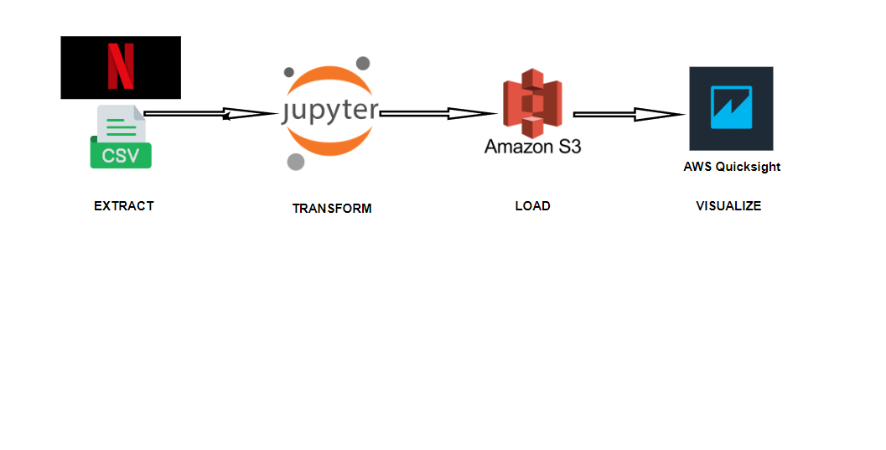

# End-to-End ETL Project with Visualization

## Introduction
This project demonstrates an end-to-end ETL (Extract, Transform, Load) process along with visualization using AWS QuickSight. The project involves extracting data from a Netflix dataset obtained from Kaggle, performing transformations on the data using pandas in Jupyter Notebook, and then analyzing the data to derive insights. Finally, the processed data is loaded into Amazon S3, and a dashboard is created in AWS QuickSight for visualization.

## Project Workflow
1. **Data Extraction from Kaggle**:
   - The project starts with obtaining a dataset from Kaggle containing information about Netflix shows.

2. **Data Loading and Transformation in Jupyter Notebook**:
   - The dataset is loaded into a Jupyter Notebook environment.
   - Using pandas, the dataset undergoes various transformations such as cleaning, filtering, and aggregation to prepare it for analysis.

3. **Data Analysis**:
   - Several analysis tasks are performed on the transformed dataset to derive insights, including:
     - Content analysis by type (movie or TV show)
     - Director/Cast analysis
     - Geographical analysis
     - Temporal analysis
     - Rating and duration analysis
     - Genre analysis

4. **Data Loading into Amazon S3**:
   - The processed dataset is loaded into an Amazon S3 bucket for storage and accessibility.

5. **Dashboard Creation in AWS QuickSight**:
   - Using the data stored in S3, a dashboard is created in AWS QuickSight to visualize the insights derived from the analysis.

## Files and Directory Structure
- `netflix_dataset.csv`: The original dataset obtained from Kaggle.
- `etl_analysis.ipynb`: Jupyter Notebook containing the ETL process and data analysis using pandas.
- `analysis_results.csv`: CSV file containing the results of the analysis.
- `netflix_dashboard.pdf`: Pdf file exported from AWS QuickSight, showcasing the dashboard visualization.
- `README.md`: This file, providing an overview of the project.

## Dashboard Visualization

## Conclusion
This project demonstrates an end-to-end ETL process starting from data extraction to visualization. By leveraging tools like pandas for data manipulation, Amazon S3 for data storage, and AWS QuickSight for visualization, valuable insights can be derived from the dataset, aiding in decision-making processes.
